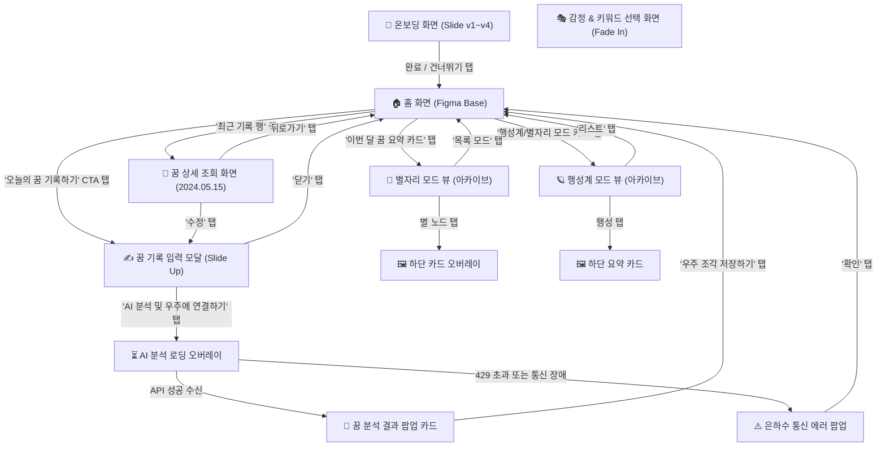

# 드림로그(DreamLog) 기획 명세서: 기초 애니메이션 및 연동 흐름 사양

본 문서는 드림로그(DreamLog) 모바일 앱의 5개 주요 화면 설계 명세를 기반으로, 사용자 편의를 위한 **화면 전환 내비게이션 흐름**, **기초 애니메이션 구조 및 햅틱 피드백 규격**, 그리고 **AI 분석 의사결정 순서도**를 상세 정의합니다.

---

## 1. 전체 화면 전환 및 내비게이션 흐름도 (Screen Transition Diagram)

아래의 도형 다이어그램(그림)은 앱 실행 후 온보딩 단계부터 꿈 기록, 상세 조회, 그리고 아카이브 뷰(별자리/행성계)로 이어지는 사용자 행동 흐름 및 화면 연결 구조를 나타냅니다.



---

## 2. 꿈 기록 및 AI 분석 로직 처리 순서도 (Decision Flowchart)

사용자가 꿈 일기를 제출했을 때 프론트엔드와 백엔드 서버 간에 일어나는 유효성 검사, API 호출 및 예외 처리(429) 로직 흐름도입니다.

```mermaid
flowchart TD
    Start([사용자 꿈 일기 제출]) --> LengthCheck{"글자 수 검사 (trimmed)"}
    
    %% 글자 수 검증
    LengthCheck -->|5자 미만| ErrShort[HTTP 400: '꿈 내용이 너무 짧습니다.']
    LengthCheck -->|8000자 초과| ErrLong[HTTP 400: '최대 8,000자까지만 전송 가능합니다.']
    LengthCheck -->|정상 (5자~8000자)| LimitCheck{"오늘 이미 요청했는가? (하루 1회)"}
    
    %% 에러 팝업 분기
    ErrShort --> ErrorAlert[⚠️ 은하수 통신 에러 팝업 출력]
    ErrLong --> ErrorAlert
    
    %% 하루 1회 한도 체크
    LimitCheck -->|Yes (오늘 이미 요청함)| Err429[HTTP 429: '오늘의 분석 기회를 모두 사용하셨습니다.']
    LimitCheck -->|No (오늘 첫 요청)| APIRequest[Google Gemini 1.5 Flash API 호출]
    
    Err429 --> ErrorAlert
    
    %% API 결과 처리
    APIRequest -->|성공 (JSON 반환)| SaveLimit[서버 메모리/DB에 오늘 날짜로 요청 기록 저장]
    APIRequest -->|네트워크 단절 / 서버 500 에러| Err500[HTTP 500: '꿈 우주 연결이 불안정합니다.']
    
    SaveLimit --> RenderResult[🔮 꿈 분석 결과 팝업 카드 오픈]
    Err500 --> ErrorAlert
```

---

## 3. 기초 애니메이션 구조 스펙 (Basic Animation Specs)

애플 특유의 매끄럽고 일관된 반응 속도를 구현하기 위한 물리 및 시간 파라미터 값입니다.

### 1) 온보딩 화면 페이징 트랜지션 (`OnboardingScreen.tsx`)
* **이동 효과**: 좌우 슬라이드 시 이질감이 없도록 미세한 감속 베지에 곡선을 활용합니다.
* **시간 설정**: `TRANSITION_DURATION_MS = 260` (0.26초)
* **이징 함수**: `Easing.bezier(0.22, 1, 0.36, 1)` (감속형 애니메이션, 시작은 빠르고 끝은 서서히 감속)
* **Active Dot (페이지 인디케이터)**: 
  - 현재 활성화된 도트(Dot)는 다음 장으로 이동 시 스케일이 역동적으로 변화합니다.
  - 스케일 변화율: `0.92` (이동 시작) ➔ `1.12` (최대 팽창) ➔ `1.0` (원래 크기로 안착)

### 2) 모든 버튼 탭 미세 상호작용 피드백 (`pressedFeedback`)
* **동작 트리거**: 투명 Pressable 영역을 누르는 터치 다운(Touch Down) 즉시 발동합니다.
* **스케일 변화**: `transform: [{ scale: 0.96 }]` (살짝 눌려 들어가는 쫀득한 느낌 부여)
* **불투명도 변화**: `opacity: 0.75` (버튼이 투명해지며 활성화되었음을 인지)

### 3) 모달 및 오버레이 등장 모션
* **꿈 기록 바텀 시트 모달**: `animationType="slide"`
  - 화면 아래에서 위로 부드럽게 미끄러지듯 등장하고(Slide Up), 닫을 때는 아래로 내려갑니다(Slide Down).
* **AI 분석 로딩 오버레이 & 결과 카드 & 에러 팝업**: `animationType="fade"`
  - 화면이 완전히 전환되지 않고 기존 화면 위에 서서히 겹쳐지도록 페이드인/아웃 효과를 적용합니다.

---

## 4. 기초 햅틱 피드백 매핑 테이블 (Haptic Feedback)

물리적 진동 피드백을 적절히 결합해 사용자 경험을 애플 감성으로 보완합니다. (React Native 런칭 시 `react-native-haptic-feedback` 또는 Expo `expo-haptics` 라이브러리로 제어 가능)

| 상황 (Context) | 진동 세기 및 유형 (Haptic Type) | 설명 |
| :--- | :--- | :--- |
| **일반 버튼/탭바 터치** | `Light` (가벼운 충격) | 터치가 정상 입력되었음을 알리는 가볍고 톡 쏘는 반응 |
| **감정/키워드 항목 다중 선택** | `Selection` (선택 변화) | 체크박스를 선택하거나 해제할 때의 미세한 클릭감 |
| **AI 분석 최종 성공 완료** | `NotificationSuccess` (성공 알림) | 꿈 분석 결과 카드가 화면에 팝업되는 성공적인 성취감 표현 |
| **분석 한도 초과(429) 및 오류** | `NotificationWarning` / `Error` (경고) | 한도 도달 또는 인터넷 단절을 알리는 묵직하고 거친 3회 진동 |
